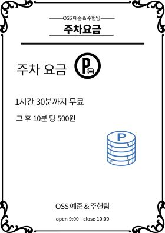

# TeamProject
## mini project 주제

- 카페 주문과 주차관리

## mini project 에 대한 소개

- 카페에서 사장님은 메뉴를 추가, 수정, 삭제할 수 있고, 손님들은 메뉴를 조회,주문을 할 수 있다. 주차를 한 손님들은 나갈 때 주차요금도 알 수 있다.

## image(pixabay 등 무료 이미지 활용)    
    
   

## mini project 가 가지고 있는 대략적인 기능 설명

- 카페사장님들은 처음에 메뉴가 없다면 비밀번호를 설정하고, 비밀번호를 입력해야 카페에 있는 메뉴들을 추가하고, 수정하고 , 삭제할 수 있다.
  - 만약 이를 메뉴를 다 작성하고 저장하면,  다음부터는 메뉴를 불러올 수 있다.
- 고객은 메뉴를 조회, 선택할 수 있고, 영수증 출력을 원하면 출력해준다.
- 만약 주차를 했다면 주차 차량과 입장시간을 입력하고, 나갈 때에도 시간을 입력하여 이를 계산하여 주차 요금을 출력해준다.
  - 1시간 30분까지만 주차가 무료이고, 그를 초과하게 되면 주차 요금이 나오는지 계산해 출력해준다.

## 개발환경 및 언어

- C언어

## 팀소개 및 팀원이 맡은 역할

- **김예준:** 19학번 전산심화를 전공 중입니다.

