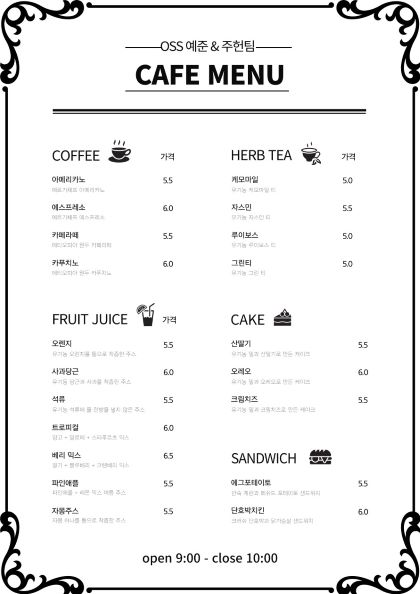
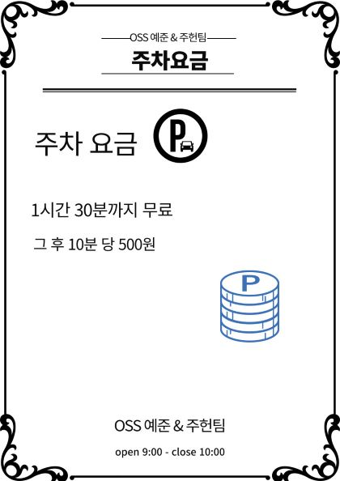

# TeamProject
## mini project 주제

- **카페 주문과 주차관리**

## mini project 에 대한 소개

- 카페에서 **사장님**은 메뉴를 **추가, 수정, 삭제**할 수 있고, **손님**들은 메뉴를 **조회,주문**을 할 수 있다. 주차를 한 손님들은 나갈 때 **주차요금**도 알 수 있다.

## image(pixabay 등 무료 이미지 활용)    
   

## mini project 가 가지고 있는 대략적인 기능 설명

- **카페사장님**들은 처음에 **지정된 비밀번호로 로그인**하여야만, **카페 메뉴들을 추가하고, 수정하고 , 삭제**등 관리 할 수 있다.
  - 만약 이를 메뉴를 다 작성하고 저장하면,  카페 이용자들의 메뉴판에 **업데이트 된 메뉴들**이 올라간다.
- **손님**은 **메뉴를 조회, 선택**할 수 있고, **영수증 출력**을 원하면 출력해준다.
- 만약 주차를 했다면 주차 차량과 입장시간을 입력하고, 나갈 때에도 시간을 입력하여 이를 계산하여 **주차 요금**을 출력해준다.
  - 1시간 30분까지만 주차가 무료이고, 그를 초과하게 되면 주차 요금이 나오는지 계산해 출력해준다.

## 개발환경 및 언어

- **C언어**

## 팀소개 및 팀원이 맡은 역할

- **김예준:** 19학번 전산심화를 전공 중입니다.
- **김주헌:** 19학번 공간환경시스템 공학과 검퓨터 공학을 전공중입니다.
